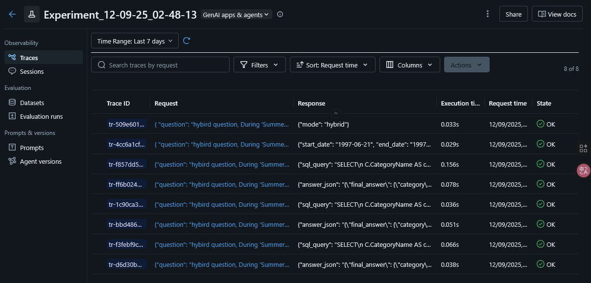

# Retail Analytics Copilot (DSPy + LangGraph)

AI agent that answers retail analytics questions by combining Retrieval-Augmented Generation (RAG) over local documents with SQL execution against a SQLite database. Built with DSPy for optimized components and LangGraph for stateful workflow orchestration.

## Graph Design

  
The agent implements a **hybrid multi-node architecture** with intelligent routing and self-repair capabilities:

- **Router Node (DSPy)**: Classifies incoming questions into three modes: `rag` (document-only), `sql` (database-only), or `hybrid` (both sources required)
- **Retriever Node**: Uses BM25 ranking to fetch top-k relevant document chunks with scores and chunk IDs for citation tracking
- **Planner Node (DSPy)**: Extracts structured constraints from questions (date ranges, KPI formulas, category filters, entities) to guide SQL generation
- **NL→SQL Node (DSPy)**: Generates SQLite queries using live schema introspection via PRAGMA, incorporating planner constraints and RAG context
- **SQL Executor Node**: Executes queries with comprehensive error handling, capturing columns, rows, and error messages
- **Synthesizer Node (DSPy)**: Produces typed answers matching exact `format_hint` requirements (int, float, dict, list) with citations to both database tables and document chunks
- **Evaluator Node**: Computes confidence scores based on SQL success, result coverage, RAG chunk quality, and repair iterations
- **Refactor Node**: Implements a **self-repair loop** (max 2 retries) that detects SQL errors, invalid output formats, or missing citations and routes back to appropriate nodes for correction
- **End Node**: Outputs final structured results with audit trail

**Flow Logic**: The router determines the path—pure RAG questions skip SQL nodes, pure SQL questions skip retrieval, and hybrid questions use both pipelines. After synthesis, the refactor node validates output and repairs issues before termination.

**Tracing**: Using MLflow built-in dspy autolog, it enables tracing each node's input & output. All within one experiemnt labeled by the date and time of the run.
      

## DSPy Optimization

**Optimized Module**: **Router Node** 

**Optimization Strategy**: Applied **MIPROv2** to improve routing decision.


**Training Data**: 15 labeled questions

**Key Improvements**:
- The optimizer did not add so much as the model was already efficient enough.


## Usage

```bash
# Run batch evaluation
python run_agent_hybrid.py \
  --batch sample_questions_hybrid_eval.jsonl \
  --out outputs_hybrid.jsonl
```

## Output Format

Each result in `outputs_hybrid.jsonl` follows the contract:

```json
{
  "id": "rag_policy_beverages_return_days", "final_answer": 14,
  "sql": "",
  "confidence": 0.6718845466228789,
  "explanation": "The product policy specifies a 14-day return window for unopened beverages. This information is directly stated in the 'Returns & Policy' document.",
  "citation": ["product_policy::chunk8"]
}


```

## Setup

```bash

# running MLflow UI
mlflow ui

```

```bash
# Install dependencies
pip install -r requirements.txt

# Download Northwind database
mkdir -p data
curl -L -o data/northwind.sqlite \
  https://raw.githubusercontent.com/jpwhite3/northwind-SQLite3/main/dist/northwind.db

```

## Project Structure

```
.
├── agent/
│   ├── llm_set_up.py            # Setting up the API key and the model
│   ├── graph_hybrid.py          # LangGraph workflow (9 nodes + repair)
│   ├── dspy_signatures.py       # DSPy modules (Router, Planner, NL→SQL, Synth)
│   ├── rag/retrieval.py         # BM25 retriever with chunking
│   ├── tools/sqlite_tool.py     # Database access + schema introspection
│   └── tools/repair.py          # Self-repair validation logic
├── optimizing_router_node.ipynb # Notebook MIPROV2 optimzing Router Node
├── testing.py                   # garbage file to test anything
├── data/northwind.sqlite        # Northwind sample database
├── docs/                        # RAG document corpus (4 markdown files)
├── mlruns/                      # Directory of MLflow saving history of runs
├── sample_questions_hybrid_eval.jsonl
├── outputs_hybrid.jsonl         # Generated results
├── run_agent_hybrid.py          # CLI entrypoint
└── requirements.txt
```

## Key Features
 
✅ **Hybrid Intelligence** – Combines structured SQL with unstructured document retrieval  
✅ **Self-Repairing** – Automatically fixes SQL errors and format issues up to 2 iterations  
✅ **Typed Outputs** – Enforces exact format adherence (int, float, dict, list) with validation  
✅ **Auditable** – Full citation tracking for both database tables and document chunks  
✅ **DSPy Optimized** – has the ability to optimize any nodes in the future in case of new/local model.

## 📝 License

MIT License - Educational project for AI/ML coursework

---

**Built with**: DSPy 2.4+ | LangGraph 0.1+ | Ollama (Phi-3.5) | SQLite | BM25